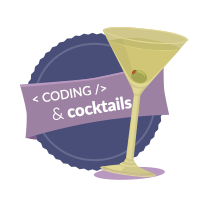

    
    <h2 style="display:inline-block;margin-top:1em;">Coding &amp; Cocktails Session 9:</h2>
    <h3 style="margin-top:0;margin-bottom:2em;">Server-side APIs: Node.js, REST & SOAP</h3>

### Overview {#overview}

Tonight you'll build a single page application that allows the user to play and a trivia game using an API. We'll build this using Angular2.

## Hints


While following along with the worksheet, type out the commands instead of doing a copy & paste (_unless instructed to copy & paste_) to avoid inadvertently using any incorrect characters.



First time at Coding & Cocktails?   [Click here to Install the Tools!](http://bit.ly/CnCTheTools)



Don't know a term?   [Click here to check out our glossary!](http://bit.ly/CnCgloss)



Want to be more efficient at working with your computer?

[Click here to see our list of Helpful Keyboard Shortcuts!](/reference-helpful-keyboard-shortcuts.md)


Look for these formatting hints throughout the workbook.

