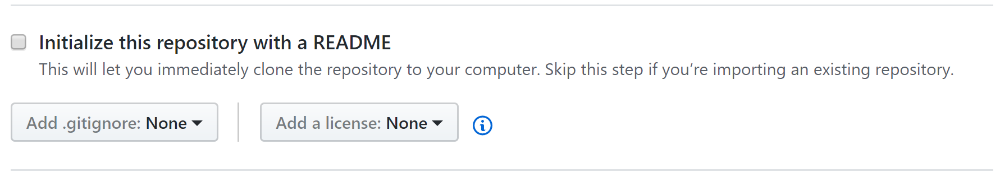
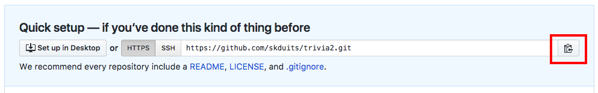
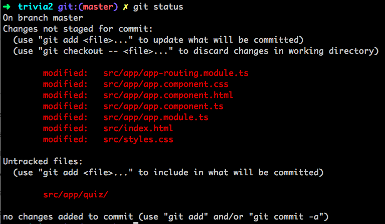
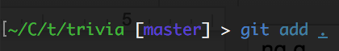
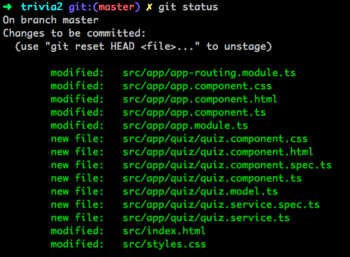
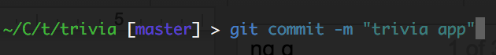

### Deploy App to GitHub Pages 

Angular CLI initialized a git repository for you in your source folder. Angular CLI provides us a command to deploy our app to GitHub Pages.


##### Hey Slacker!

Remember, we're here to help.
Join the KCWiT #codingandcocktails Slack Channel: [kcwit.slack.com](http://kcwit.slack.com)



##### Don't know or remember git?

See the git version control worksheet from earlier this year: [bit.ly/CnCAprWork](http://bit.ly/CnCAprWork)


1. Make sure you have created your GitHub account from [the tools setup](https://codingandcocktailskc.gitbooks.io/coding-cocktails-the-tools/content/user-accounts---github-slack--codecademy.html) and are logged in to [https://github.com](https://github.com/) in Google Chrome.

2. Create a new repository named **trivia** on github.com.

  1. In Google chrome, navigate to [https://github.com](https://github.com/)
  
  2. In the upper-right corner, press <span class="octicon octicon-plus"></span>, and then select **New repository**.

    
Make sure **Initialize this repository with a README** is **unchecked**.


  
  
  3. Press the green **Create Repository** button.

6. You must connect the repository from GitHub (on the internet) to this repository you now have locally on your computer. This is called adding a remote repository. 

  
For more information on working with remotes read [Git Basics - Working with Remotes from the Pro Git book](https://git-scm.com/book/en/v2/Git-Basics-Working-with-Remotes)
  

  1. In Google Chrome on the GitHub site make sure you have your 'trivia' repository open.
  
  2. Click on the <span class="octicon octicon-clippy"></span> icon to copy the URL.
  
     

  3. In Cmder or iTerm2, add the remote. Type: 
     Cmder/iTerm2
     ```bash
     git remote add origin https://github.com/<your_github_username>/trivia.git
     ```

    Replace the git URL with the URL you copied from the GitHub site in the previous step above.

7. Check which directories/files are unstaged (that Git doesn't yet know about). Type: `git status`
  
  Your files should display under a header of "Changes not staged for commit:" and should be red in color.
  
  

8. Stage the files so Git knows which files to deal with.  In this case we want all of them so we just add all the files in the current directory. The current directory can be referenced as: `.`.  Type: `git add .`

  

9. Check to ensure all of your files are staged and ready to be committed. Type: `git status`
  
  Now, your files should display under a header of "Changes to be committed:" and should be green in color.
  
  

10. Commit the files so Git understands what group of changes to deal with.  Feel free to change the commit message (the part in the quotation marks) if you'd like! Type: `git commit -m "I built a Single Page Application!"`

  

11. Install the **ghpages-cli** package. Type: 
   Cmder/iTerm2
   ```bash 
   npm i -g angular-cli-ghpages
  ```

12. Build the application so it is ready for production.  Type: 
   Cmder/iTerm2
   ```bash
   ng build --prod --base-href "https://yourusername.github.io/trivia/"
   ```

  Replace "yourusername" with your own personal GitHub username. If your GitHub username was "gracehopper" your command would be: `ng build --prod --base-href "https://gracehopper.github.io/trivia/"`.

13. Run the deploy step.  Type: 
   Cmder/iTerm2
   ```bash
   angular-cli-ghpages
   ```

14.  View your App from Chrome or from your phone! The URL for your app should be something like https://yourusername.github.io/trivia


