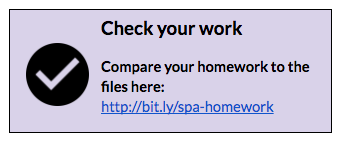

# Add a New Route


##### Hey Slacker!

Remember, we're here to help.
Join the KCWiT #codingandcocktails Slack Channel: [kcwit.slack.com](http://kcwit.slack.com)



##### Don't know or remember git?

See the git version control worksheet from earlier this year: [bit.ly/CnCAprWork](http://bit.ly/CnCAprWork)



### About Route

  1. In Cmder or iTerm2, create a new component called **about**. Type: 
     ```bash 
     ng g component about
     ```

  2. In Atom, open the _src/app/app-routing.module.ts_ file.

    1. You need to `import` your **About** component for routing, so add that import statement to the top of the file similar to the way the QuizComponent import.

    2.  Next, add the **about** route to the `routes` array.

      
The format for a route looks like this [replace the _urlpath_ and _MyComponent_ words with your the urlpath you want to define and the component that should be displayed at that path]:

```ts
{
  path: 'urlpath',
  component: MyComponent
}
```

When defining a route, don't include the '/' at the beginning
      

  3.  Visit your app in Chrome to checkout your new route!  [http://localhost:4200/about](http://localhost:4200/about)
  
      Since you didn't set up any content for the new route, it will just show some simple default content:
      
      

  [](http://bit.ly/spa-homework)
  
### Push new route to GitHub Pages

1. Check which directories/files are unstaged (that Git doesn't yet know about). Type: `git status`

2. Stage the files so Git knows which files to deal with.  In this case we want all of them so we just add all the files in the current directory. The current directory can be referenced as: `.`.  Type: `git add .`

9. Check to ensure all of your files are staged and ready to be committed. Type: `git status`

10. Commit the files so Git understands what group of changes to deal with.  Feel free to change the commit message (the part in the quotation marks) if you'd like! Type: `git commit -m "I built another route!"`

12. Build the application so it is ready for production.  Type: `ng build --prod --base-href "https://yourusername.github.io/trivia/"`

  Replace "yourusername" with your own personal GitHub username! If your GitHub username was "gracehopper" your command would be: `ng build --prod --base-href "https://gracehopper.github.io/trivia/"`.

13. Run the deploy step.  Type: `angular-cli-ghpages`

14.  View your about route from Chrome or from your phone! The URL for your app should be something like https://yourusername.github.io/trivia/about

Replace "yourusername" with your own personal GitHub username! If your GitHub username was "gracehopper" your URL would be: https://gracehopper.github.io/trivia/about
