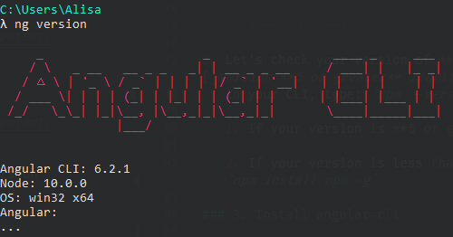

# Setup {#top}
Tonight we will use a SPA framework to create a web application. Follow the instructions on this page to prepare your workspace.

<!-- trick markdown to give me a little space between these two sections of text -->
## 
If this is your first time at Coding & Cocktails [click here to install the tools](http://bit.ly/CnCTheTools). For a minimum list of tools needed for tonight's worksheet, check out the [Requirements for this session](#requirements) list.

### Slack
[Open the **codingandcocktails** channel on Slack](https://kcwit.slack.com/messages/C0BGBKGG6).
If you have a tip that helped you with a step on the worksheet, you can easily share it with the group in Slack. Or if there are any issues with the worksheet [we make typos or there's an update to a tool that we didn't catch before the session], we may post updates in Slack. Plus, after class is over, Slack becomes a tool for you to gain access to mentors as you go through the homework, or any other questions that arise.


If you are borrowing a Coding & Cocktails laptop, you can skip the setup. All the tools you need are already installed for you.


## Requirements for this session {#requirements}

You will need the following tools for the worksheet:
1. [Chrome browser](https://codingandcocktailskc.gitbooks.io/coding-cocktails-the-tools/content/tools-browser/)

1. [GitHub account](https://codingandcocktailskc.gitbooks.io/coding-cocktails-the-tools/content/user-accounts/)

1. [Git](https://codingandcocktailskc.gitbooks.io/coding-cocktails-the-tools/content/tools-git/)

1. [Atom IDE](https://codingandcocktailskc.gitbooks.io/coding-cocktails-the-tools/content/tools-atom/)
   1. Ensure you installed the required plugin **atom-typescript**

1. [Node & npm](https://codingandcocktailskc.gitbooks.io/coding-cocktails-the-tools/content/tools-node/)
   
Confirm your version of Node returns **9.11 or greater**. Confirm your version of npm returns **5.8 or greater**. Follow [the instructions in the link]((https://codingandcocktailskc.gitbooks.io/coding-cocktails-the-tools/content/tools-node/)) to confirm versions, install, and update Node and npm.
   

1. [Terminal for your OS](https://codingandcocktailskc.gitbooks.io/coding-cocktails-the-tools/content/tools-command-line/)
   
**Attention Windows users**

Don't forget to open Cmder using **Run as administrator** to avoid file access problems tonight. Follow the instructions in the [Using Cmder section of The Tools](https://codingandcocktailskc.gitbooks.io/coding-cocktails-the-tools/content/tools-command-line/cmder.html#using-cmder).

Use Cmder for tonight's session. You will have problems if you use Git Bash. Feel free to grab a mentor if you need help installing Cmder.
   

1. [Coding & Cocktails folder](https://codingandcocktailskc.gitbooks.io/coding-cocktails-the-tools/content/tips-directory-structure/)

1. [Angular CLI](https://codingandcocktailskc.gitbooks.io/coding-cocktails-the-tools/content/tools-angular-cli/)
   Confirm your version of Angular CLI return 6.1 or greater.

   
   
   
This may take a minute or two to complete. Perfect excuse to grab yourself a drink and introduce yourself to your neighbor with this ice-breaker question-- What was your neighbor's favorite Halloween costume?
   

## Helpful tips as you work through the worksheet {#tips}


View the worksheet and your IDE in split screen. 

For Windows users, use `windows key` + `left arrow` or `windows` + `right arrow` to resize the application and position to the left or right half of your screen.

For Mac users, hold down the full-screen button in the upper-left corner of a window to shrink and position to the left or right side of the screen. Release the button, then click another window to begin using both windows side by side.

Mentors are happy to help!



Did you know you can collapse the table of contents for worksheets?

Click on the hamburger menu (<i class="fa fa-bars" aria-hidden="true"></i>) at the top of the page to toggle the table of contents. You can also use the keyboard shortcut `s`.



Did you know you can customize font size and color of the worksheets to make it easier for you to see?

Click on the font menu (<i class="fa fa-font" aria-hidden="true"></i>) at the top of the page to open a menu where you can make your font larger or smaller or change background color.