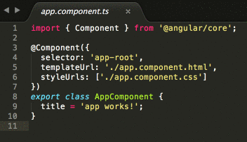

# Starting your Single Page Application {#top}
Tonight we will create a web application using a SPA framework with interactive elements and dynamic content that looks like this:


<!-- trick markdown to give me a little space between these two sections of text -->
## 

Before starting the worksheet, please take a moment to review [Setup instructions](/setup) to ensure you have all the tools and workspace setup you need for tonight's work.


<!-- trick markdown to give me a little space between these two sections of text -->
## 
## Application Foundation
Start with creating your application’s foundation by scaffolding the application using Angular CLI. Open Cmder (Windows) or iTerm2 (Mac) and rock &amp; roll.

1. In your Command Line Interface (aka CLI: That means Cmder or iTerm2), navigate to your "CodingAndCocktails" folder by typing: 

     
cd ~/CodingAndCocktails
    
cd %USERPROFILE%/CodingAndCocktails
   

  
  Then press `Enter`. You will need to press `Enter` after any command you enter in the command line.

  
#### Command line woes?
  - Your home directory is:
    - Mac: `/users/<yourUsername>`
    - Windows: `C:/Users/<yourUsername>`
  - Command to change folders: `cd <folderToGoTo>`
  - Command to make a folder: `mkdir <newFolder>`
  - You can also use **~** for Mac or **%USERPROFILE%** for Windows as a shortcut in CLI for your home directory: `cd ~` for Mac and `cd %USERPROFILE%` for Windows.

  Revisit the command line worksheet from March:
[bit.ly/CnCMarWork](http://bit.ly/CnCMarWork)
  

2. In Cmder or iTerm2, use Angular CLI to scaffold the project. Type
  iTerm2/Cmder
  ```bash
ng new trivia --routing
  ```
  
Angular CLI automatically creates the project directory for you. In this case, it will create a new folder called "trivia".
  
    
Scaffolding the application and installing all the required npm packages can take a few minutes. Perfect time to get to know your neighbor. Here's an icebreaker question-- What is your neighbor's spirit animal?
  

3. Change the directory to the new one Angular CLI created for you. 
  iTerm2/Cmder
  ```bash
cd trivia
  ```

4. Run your new app.
  iTerm2/Cmder
  ```bash
ng serve
  ```

  
This command will:

1. Compile your TypeScript files into JavaScript
2. Start a local server on our computer so you can view your project prior to making it live on the internet
3. Watch your project files for changes so that when one of them changes it will automatically reload in the browser for you and avoid the step of having to press the **Refresh** button to see every update you make.
  
  
  
To stop the server and get back to your command prompt, press the `ctrl` + `c` keys on your keyboard.
  

5.  In Google Chrome, navigate to [http://localhost:4200](http://localhost:4200) to see your working (basic) app.

6. Open a new CLI tab or window. You'll want to leave `ng serve` running in your CLI tool to see the live updates as you progress through the project. To open a new tab make sure your terminal window is active and press `cmd` + `t` on Macs and `ctrl` + `t` on Windows.

7. Check where you are in the filesystem by typing `pwd`.

   If `pwd` doesn't display your "CodingAndCocktails/trivia" folder, navigate to your "trivia" project folder by typing the command for your OS in your new tab:
    
cd ~/CodingAndCocktails/trivia
    
cd %USERPROFILE%/CodingAndCocktails/trivia
   

## Make a Change

Now, you'll make some updates to the app to see the live reload you get from `ng serve`! Remember the `ng serve` command watches for changes to your project files and automatically refreshes the browser for you so you don’t have to.  This is called “live reload.”

1. Open Atom via the command line by typing
   iTerm2/Cmder
```bash
atom .
```

  
##### Command not found

If Atom doesn't open (but you know it's installed), your system likely doesn't recognize the `atom` command.

You can configure your system to recognize the command (ask a mentor for help) or you can follow these steps to open it manually:
  1. From your applications or start menu, open Atom
  2. In Atom, select **File** and then select **Open...** for Mac or **Open Folder...** for Windows
  3. Open the "trivia" folder
  4. Click the **Open** button
  

2. In Atom, in the left side project pane, click on the arrow next to "src" to expand the folder.

3. Next, do the same thing next to the "app" folder to expand it.

4. Double click on the _app.component.ts_ file inside that "app" folder to open it in the right side editing pane.

5. Edit the `title` variable to whatever text you want (like: have a cocktail!)

  
If you choose a title with an apostrophe in it you'll need to escape the character by typing a `\` in front of the `'` so that the apostrophe (aka single quote) isn't interpreted as closing the string.  A title of "Coding & Cocktail's Application" would need to be written as `Coding & Cocktail\'s Application`

For more on escaping characters and why read [the "Special Characters" section on w3schools](https://www.w3schools.com/js/js_strings.asp).
  

  
This `title` will end up being the title of your trivia app.
  

  

6. Save your file using the keyboard shortcut`cmd` + `s` for Mac or`ctrl` + `s` for Windows. You can also save in Atom by navigating to **File** <i class="fa fa-long-arrow-right"></i> **Save**. Unsaved files have a blue circle in the tab.

   

7. Go back to the tab in Chrome that has your app running. You should see your updated text!

    

<!-- Trick markdown to give a little extra space -->    
## 
##### Nice work! Take a break and grab another drink, you've earned it!
