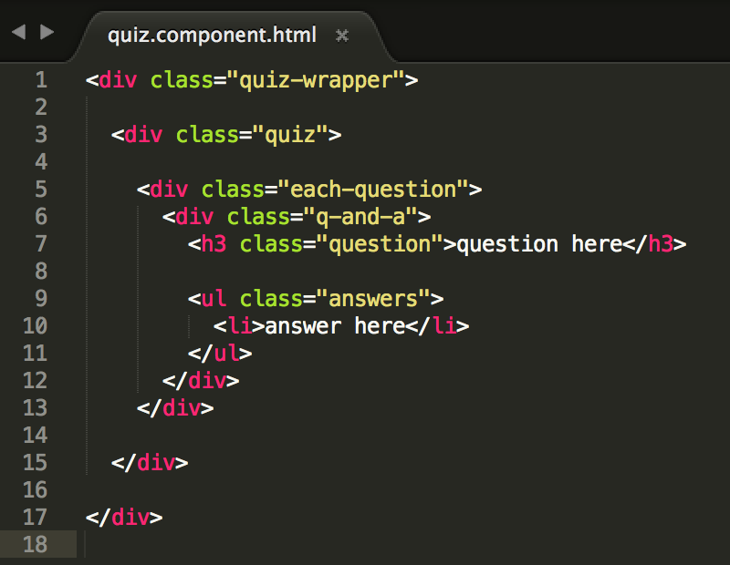

# Creating a component

Your app works, but it’s not very exciting. Add some components to it!

1. In Cmder or iTerm2, generate a component named "quiz" with Angular CLI. Type
   iTerm2/Cmder 
   ```bash
ng g component quiz
   ```

  
This creates a "src/app/quiz" directory with 4 files in it: _quiz.component.html_, _quiz.component.css_, _quiz.component.ts_ & _quiz.component.spec.ts_.  The _*.spec.ts_ files are for testing your code (to make sure your code works). You won't be using these tonight so you can ignore this _spec_ file.
  

2.  Next, add some styles to your app, so it won’t look bland as you develop it.

  1.  Copy (check out the [keyboard shortcuts](/reference-helpful-keyboard-shortcuts.md) for help!) the below CSS styles and then paste them into the _src/styles.css_ file in Atom. These are global styles that apply to the whole app.

     src/styles.css
      ```css
      body {
          align-items: center;
          background: #000;
          color: #fff;
          display: flex;
      	  font-family: 'Raleway', sans-serif;
          font-weight: 200;
          height: 100vh;
          justify-content: center;
          margin: 0;
      }

      ul {
          margin: 0;
          padding: 0;
      }
      ```
  
  3. Save the _src/styles.css_ file.

  4.  Copy the below CSS styles and then paste them into the _src/app/app.component.css_ file in Atom. These styles apply only to the markup in _app.component.html_.

      src/app/app.component.css
      ```css
      .quiz-wrapper {
          max-height: 100vh;
          max-width: 31rem;
      }

      h1 {
          color: #4db6ac;
          float: left;
          font-size: 0.9rem;
          font-style: italic;
          margin: 0;
          padding: 1rem;
      }
      ```
  
  6. Save the _src/app/app.component.css_ file.

  7.  Copy the below CSS styles and then paste them into the _src/app/quiz/quiz.component.css_ file in Atom. These styles apply only to the markup in _quiz.component.html_.

      src/app/quiz/quiz.component.css
      ```css
      .question-tracker,
      .results-header {
          color: #ff9800;
          float: right;
          font-size: 0.9rem;
          font-style: italic;
          padding: 1rem;
      }

      .quiz {
          clear: both;
      }

      .question,
      .results {
          background: #111;
          color: #cddc39;
          margin: 0;
          padding: 1rem;
      }

      .question {
          font-family: 'Playfair Display', serif;
          font-size: 2.5rem;
      }

      .answers {
          background: #1f1f1f;
            list-style-position: inside;
            list-style-type: lower-alpha;
      }

      .answers li {
            color: #f06292;
            cursor: pointer;
            font-size: 1.1rem;
            padding: 1rem;
            transition:all 0.5s ease;
      }

      .answers li:hover {
            background: #222;
            color: #ba68c8;
      }

      .results {
            font-family: 'Raleway', sans-serif;
            text-align: center;
      }

      .score {
            color: #f06292;
            font-size: 4rem;
            text-transform: uppercase;
      }

      .result-message {
            font-size: 2.8rem;
      }

      .result-action {
            color: #ba68c8;
            font-family: 'Playfair Display', serif;
            font-size: 1.8rem;
      }
      ```
  
  9. Save the _src/app/quiz/quiz.component.css_ file.
  
  10. In Google chrome, take a look at your app now.  You'll see the styles have changed and the page background is now black along with some other styling changes.
  
      

      
  #### What is this HTML & CSS stuff?!
  In an effort to keep the project focused on Single Page Applications, we're providing the HTML & CSS code for you to copy/paste. Keep an eye out to join us for our HTML & CSS sessions if you're interested in learning more!

  ##### New to HTML/CSS?
  Take a minute to read what you pasted.  Try to predict what you might see in the finished product. If you have questions about any of it, or HTML/CSS in general, grab a mentor!

  ##### Know HTML/CSS?
  Have at it! Customize the HTML/CSS to your liking!
      

3.  Now that you have styles, add the HTML markup for your templates.

  1.  Copy this HTML code.

      ```html
      <link href="//fonts.googleapis.com/css?family=Playfair+Display|Raleway" rel="stylesheet">
      ```

  2. In Atom, open the _src/index.html_ file by double clicking on it in the left side project pane.
  
  3. Find the `</head>` tag. This tag closes out the head section of your HTML document where some information about the HTML document is usually provided. 
  
  4. Place your cursor at the end of the line that looks like `<link rel="icon" type="image/x-icon" href="favicon.ico">` and press `Enter` to move to a new line.  Your cursor should now be between that `link` tag and the `</head>` tag.
  
  5. Paste the HTML code from above on this new line. The code you're pasting in adds some Google Web Fonts to make the app a bit more visually appealing.

      

  6.  Now you're going to add the **quiz** component html to the **app** component. Copy the below HTML code and replace the file contents in the _src/app/app.component.html_ file with this copied code:

      src/app/app.component.html
      ```html
      <div class="quiz-wrapper">
          <h1>{{title}}</h1>
          <router-outlet></router-outlet>
      </div>
      ```

        

  8. Save the _src/app/app.component.html_ file.
  
  9. Copy the HTML code below and replace the file contents in the _src/app/quiz/quiz.component.html_ file with this copied code:

       src/app/quiz/quiz.component.html
        ```html
        <div class="quiz-wrapper">

          <div class="quiz">

            <div class="each-question">
              <div class="q-and-a">
                <h3 class="question">question here</h3>

                <ul class="answers">
                  <li>answer here</li>
                </ul>
              </div>
            </div>

          </div>

        </div>
        ```

        
        
  9. Save the *src/app/quiz/quiz.component.html* file.

4.  Head on over to Chrome to check out how your app looks.

    

### Component Routing

Didn't you just add a component to make a quiz application?  Where is it?!  Since you used the `--routing` flag when you first generated your application, you'll need to add a default route, so that it loads your Quiz Component's HTML & CSS.

1. In Atom, double click on the _src/app/app-routing.module.ts_ file in the left side project pane to open it for editing. 

    
If the number of files you have open for editing is making it hard to remember which tab to use or just feeling overwhelming, you can close some of them by hovering your mouse cursor over the tab and clicking on the `x` that shows up. You can open and close any files at any time!
    

2. You'll need to import your Quiz Component. Place your cursor at the end of the `import { Routes, RouterModule } from '@angular/router';` line and press `Enter` to move to a new line. Type 
   src/app/app-routing.module.ts
   ```ts
import { QuizComponent } from './quiz/quiz.component';
   ```

3. Place your cursor between the brackets `[]` in `const routes: Routes = [];` and press `Enter` to create a new line between the brackets. Atom will automatically make the `];` move to the line below your cursor.  This is Atom trying to help you with formatting so that your code is more readable.

4. On this new line type: `{}`

5. Place your cursor between the curly braces and press `Enter` to create another new line.

6. Type:

   src/app/app-routing.module.ts
    ```ts
    path: '',
    component: QuizComponent
    ```

7. Your code should look similar to:
  
    
    
8. Now go look at your app in Chrome, there's your quiz!

    

    
#### App doesn't look like this?
Look back through the steps or grab a mentor!
    

<!-- Trick markdown to give a little extra space -->    
## 
##### Nice work! Take a break and grab another drink, you've earned it! 
Start a serious conversation with your neighbor-- Ask your neighbor what their spirit animal is.

