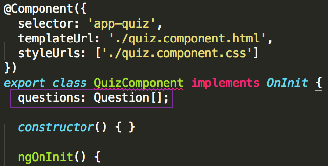

# Data Setup

Your template is working and looks pretty, but it’s hardcoded, or, in other words, it uses fixed data and requires manual editing. Next, we'll add a couple questions and answers to your component, and make the template render your quiz questions dynamically. In this section, you’ll do some set-up work for data to use in your template. Then in the next section we will be to integrate the data with your component’s template (HTML).

Later, you’ll be using an [API](http://bit.ly/CnCgloss) [Application Programming Interface], to allow your application to interface with a set of questions and answers for your quiz. In order to make that transition go smoothly, you'll set-up your data in the same format that will come from the API.

1.  Copy the following code:

    ```ts
    this.questions = [
      {
        "text": "Florence Nightingale became known as \"the Lady With the Lamp\" during which war?",
        "answers": [
          {
            "correct": false,
            "text": "American Civil War"
          },
          {
            "correct": false,
            "text": "World War I"
          },
          {
            "correct": true,
            "text": "Crimean War"
          },
          {
            "correct": false,
            "text": "World War II"
          }
        ]
      },
      {
        "text": "In a quarter-mile race, which animal can be expected to win?",
        "answers": [
          {
            "correct": false,
            "text": "Lion"
          },
          {
            "correct": true,
            "text": "Pronghorn Antelope"
          },
          {
            "correct": false,
            "text": "Quarter Horse"
          },
          {
            "correct": false,
            "text": "Giraffe"
          }
        ]
      }
    ];
    ```

2. In Atom, open your _src/app/quiz/quiz.component.ts_ file by double clicking on it in the left side Project Pane. In the `ngOnInit()` [method](http://bit.ly/CnCgloss), between the opening and closing curly braces, (`{}`), paste that code in.

  
Atom may highlight the `this.questions` text in red and you may see a warning that states "Property 'questions' does not exist on type 'QuizComponent'." when you hover over that text.
You can ignore this warning for now, we'll fix it in the next few steps.
  

  
Check your code against the answer key here: [[http://bit.ly/spa-3_1](http://bit.ly/spa-3_1)].
  

3. Create a new file named _quiz.model.ts_ in "src/app/quiz".
   
Since you’re using [TypeScript](https://www.typescriptlang.org), you'll need to set data types for the data that you just copied and pasted. This is one file Angular CLI won’t generate for you since it can't read your mind about what your application's data should look like! We'll create a model to represent the data for your application's questions and answers in _quiz.model.ts_.
   

   
<details>
<summary>
Need a little help? Expand this section for guidance. 
</summary> 
Right click on the "src/app/quiz" folder in the left side project pane in Atom and select <strong>New File</strong>. 
Name the file <i>quiz.model.ts</i> and press <code>Enter</code>.
</details>
   
   
4. In your newly created _quiz.model.ts_ file, add the code below. Feel free to manually type or copy/paste. Don't forget to save the file.
      src/app/quiz/quiz.model.ts
      ```ts
      export class Answer {
        correct: boolean;
        text: string;
      }
      
      export class Question {
        text: string;
        answers: Answer[];
      }
      ```
      
      
### What does this code do?

It defines two models, one `Answer` model and one `Question` model. It **exports** the models from this file so you can **import** the models into the file where you want to use them. If you attended the Server Side API session last month, **import** is the same as **require** and **export** is the same as adding to the `module.exports`.

The `Answer` model has 2 properties: `correct` and `text`. `correct` is of data type **boolean** (that means it can be set to either **true** or **false**). `text` is of data type **string** (that means it represents textual data or, a series of characters).

The `Question` model has two properties: `text` and `answers`. `text` is of data type **string**. `answers` is of data type **array** (this means it can hold multiple items of any data type, similar to a list like a grocery list or a honey-do list)
      
      
5. Now you'll import these models into the _quiz.component.ts_ file to use them.

  1.  In Atom, open the _src/app/quiz/quiz.component.ts_ file and below the `import` statment at the top, type: 
     ```ts
     import {} from './quiz.model';
     ```
  
  2.  Place your cursor in the middle of the curly braces `{}`. And type `A`. Atom should give you an autocomplete suggestion of `class Answer`. [Press `Tab` or `Enter` for it to autocomplete `Answer` for you.]
    
  3.  Add a comma after `Answer` and repeat the process by typing `Q` [for Question].
  
      

6. In the _quiz.component.ts_ file, right under the class declaration line (`export class QuizComponent...`), type: 
   ```ts 
questions: Question[];
   ```

    
    
      This uses the imported `Question` Model to set the type for `questions`, (the data we set earlier in `ngOnInit`).
      
6. Save the _quiz.component.ts_ file.
      
Now you've set up your data and are ready to move on to adding it to your template!