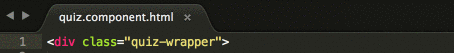
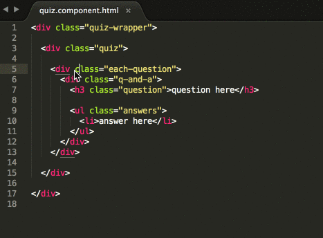
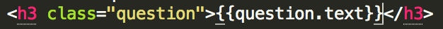
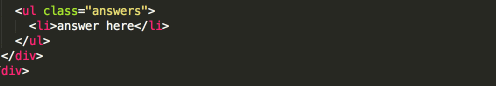
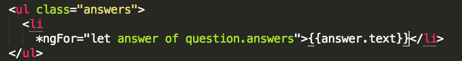
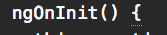
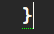
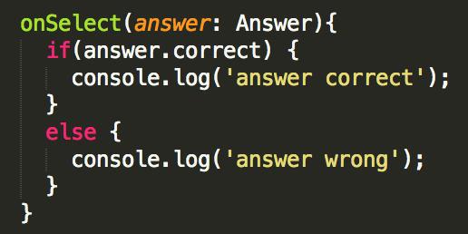

# Adding Data to Your Template

Now that you have your data ready, wire it up to your component’s template.

1. In Atom, open _src/app/quiz/quiz.component.html_.

2. In the `<div class="quiz-wrapper">` HTML element at the top of the file, place your cursor directly before the `>` to add an `*ngIf` attribute.  Type: `*ngIf="questions"`

  

  
`*ngIf` is an Angular structural attribute directive that conditionally renders our template **IF** `this.questions` is defined in our component.
  

3. In the HTML element `<div class="each-question">`, place your cursor directly in front of the `>`, press **Enter**, then press **Tab** and then type the following to add an attribute:`*ngFor="let question of questions; let i = index;"`

  

  
To help make the code easier to read, the example above starts each attribute on its own line.
  

  
### What does this code do?

This is an `*ngFor` directive that will repeat the HTML markup (including the `div` HTML element with the class `each-question`) for every question in your components `this.questions` array. Don't remember arrays? Check out the [MDN documentation on arrays](https://developer.mozilla.org/en-US/docs/Glossary/array).

It also sets a variable named `i` to `index`.  This helps to keep track of what question is currently rendered in the template by giving you the `index` of that `question`.  **Question 1 is Index 0. Question 2 is Index 1.** This will come into play later in the tutorial.
  

4. In the `<h3 class="question">` HTML element, replace the "question here" text with: 
   src/app/quiz/quiz.component.html
   ```html
{{question.text}}
   ```

  

  This will use the *question’s text* from the data you added in the last section to populate your HTML template. The data is connected to the HTML template through the _quiz.component.ts_ file using one-way binding.

5. Next, loop through the question's answers. Add an `*ngFor` attribute to the `<li>` HTML element. Place your cursor before the `>` on the element, press `Enter`, then `Tab` and then type: 
   src/app/quiz/quiz.component.html
   ```html
   *ngFor="let answer of question.answers"
   ```

  

6. Replace the text "answer here" inside the opening and closing `li` HTML tags with the following text (including the curly braces): 
   src/app/quiz/quiz.component.html
   ```html
   {{answer.text}}
   ```

  

7. You now have your template rendering questions and answers, but nothing happens when a user selects an answer. Add a *click* event so you can start tracking clicks. 

  1. In that same `<li>` tag, add a `(click)` attribute on the line below the `*ngFor`. Type:
  `(click)="onSelect(answer)"`

      

      
### What does this code do?
When a user clicks on the `<li>` HTML element holding the answer data, a method named `onSelect` in the Component's TypeScript file is executed and passes the `answer` data through to the `onSelect` method.  (You haven't yet defined the `onSelect` method in the _quiz.component.ts_ file just yet, you'll do that next!.)

Don't remember events and event handlers? Check out [MDN documentation on events](https://developer.mozilla.org/en-US/docs/Learn/JavaScript/Building_blocks/Events).
      

8. Save the _src/app/quiz/quiz.component.html_ file.

9. In Atom, open the _src/app/quiz/quiz.component.ts_ file.  Copy the code below:
   src/app/quiz/quiz.component.ts
    ```ts
    onSelect(answer: Answer){
      if (answer.correct) {
        console.log('answer correct');
      }
      else {
        console.log('answer wrong');
      }
    }
    ```

10. Paste the code in after the closing curly brace of the `ngOnInit() {...}` (the method does have content inside the curly braces in your file).

  
If you place your cursor near a parentheses, curly brace, or square bracket, Atom will highlight the corresponding opening or closing parentheses, curly brace, or square bracket with a small green dotted line to help you figure out code alignment.




  

  

  
### What does this code do?
You're declaring that the `answer` parameter is of data type `Answer`.  Then, if the selected answer (the answer passed to the `onSelect` method) is correct, we log "answer correct" to the development console.  If the selected answer is incorrect, we log "answer wrong" to the development console.
  
  
11. Save your _src/app/quiz/quiz.component.ts_ file.

12. In Google Chrome, view your application using your new data.

    
Application not working?  You may have had an error during development that the server wasn't able to overcome.  Try stopping the `ng serve` command in iTerm2 (mac) or Cmder (windows) by pressing the `ctrl` + `c` keys and restarting it by typing `ng serve` and pressing `Enter`.  Refresh the page in Google Chrome.  If you're still having issues, grab a mentor to help troubleshoot!
  

12. In Google Chrome, open the development console on a Mac by pressing the `command` + `option` + `i` keys or on a Windows machine by pressing `F12` keys.  See what happens in the console when you interact with your quiz application!

Your _src/app/quiz/quiz.component.ts_ file should look like the answer key here: [[http://bit.ly/spa-6_b](http://bit.ly/spa-6_b)].
