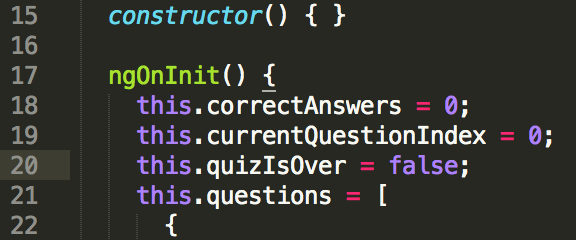
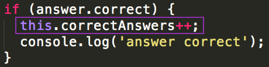
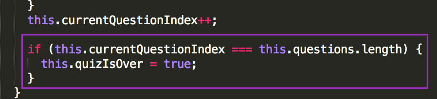
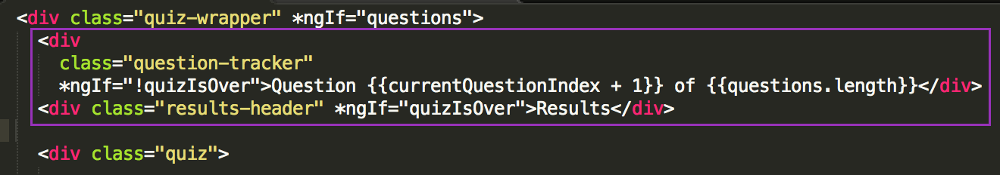

# Tally Correct Answers and Show Results

Now you have questions and answers to create a quiz, but at the end of the quiz, the user won’t know how many they answered correctly. Add a counter that keeps track of the correct answers throughout a quiz and displays the results at the end!

1. Copy the code below and paste the code into your _src/app/quiz/quiz.component.html_ file before the final closing `</div>` HTML tag using Atom.
   src/app/quiz/quiz.component.html
   ```html
  <div class="results" *ngIf="quizIsOver">
     <div class="result-message">
       You answered {{correctAnswers}} out of {{questions.length}} questions correctly.
     </div>
     <div class="score">That's {{ correctAnswers / questions.length * 100 }}%</div>
     <div class="result-action">Grab a cocktail &amp; celebrate!</div>
  </div>
  ```

  

  
### What does this code do?
  - The `div` HTML element with the `class="results"` only shows **if** the `quizIsOver`
  - The `div` HTML element with the `class="result-message"` tells the user how many `correctAnswers` they had out of the total number of questions
  - The `div` HTML element with the `class="score"` calculates and displays the percentage of correct answers
  - The `div` HTML element with the `class="result-action"` displays a fun message
  - `quizIsOver` and `correctAnswers` are highlighted because you still need to define those methods in the _quiz.component.ts_ file.
  

2. In Atom, open the _src/app/quiz/quiz.component.ts_ file.

3. On the next line below the `questions: Question[];` code, add 3 new variables and their data types. Type: 
   src/app/quiz/quiz.component.ts
  ```ts
  correctAnswers: number;
  currentQuestionIndex: number;
  quizIsOver: boolean;
  ```

  

8. Next, in Atom, in the same _src/app/quiz/quiz.component.ts_ file, find the `ngOnInit` function. Before the `this.questions` code, set default values for these 3 new variables that you just created. Place your cursor after the opening curly brace of the `ngOnInit() {` line and press `Enter`.

  1. Type: 
    src/app/quiz/quiz.component.ts
    ```ts
    this.correctAnswers = 0;
    this.currentQuestionIndex = 0;
    this.quizIsOver = false;
    ```

      

      
##### Why these defaults?
  - `correctAnswers` and `currentQuestionIndex` both start at 0 because the quiz hasn't started yet.
  - `quizIsOver` starts as false because the quiz can't be over if it hasn't started yet.
      

9. Increment your `correctAnswers` variable, every time an answer is correct.

  1. Find the `onSelect` method towards the bottom of the file. Place your cursor at the end of the `if (answer.correct) {` line of code and press `Enter`.  You're now in the body of the if statement. Type: `this.correctAnswers++;`

    

    
That line of code will update the value of the `correctAnswers` variable by one each time that line of code executes (when the `answer` is "correct").

`++` is a common way of incrementing a number by one in many programming languages!
    

10. Next, increment the `currentQuestionIndex` variable by one every time an answer is selected (correct or not).

  1. The `if` statement has an `else` clause as well. Place your cursor after the closing `}` for the `else` clause and press `Enter`.  

  2. Type: 
  src/app/quiz/quiz.component.ts
  ```ts
  this.currentQuestionIndex++;
  ```
      

  3.  Press `Enter` to move to the next line and type:
      src/app/quiz/quiz.component.ts
      ```ts
      if (this.currentQuestionIndex === this.questions.length) {
      ```

      Notice Atom automatically adds the closing curly brace `}` for you.

  4. Press `Enter` and set the `quizIsOver` variable to the value `true` in the `if` statement body.  Type: 
     src/app/quiz/quiz.component.ts
     ```ts
     this.quizIsOver = true;
     ```

      

      
When the `currentQuestionIndex` value is the same as the number of questions in the quiz (`questions.length` value), `quizIsOver` is set to true.
    

  5. Save your _src/app/quiz/quiz.component.ts_ file.

11.  Right now, you see all the quiz questions at once. Even when the results display, the questions and answers are still visible. Add an `*ngIf` attribute, so you only see one question at a time.

  1.  Open the _src/app/quiz/quiz.component.html_ file. In the `<div class="q-and-a">` HTML element, add the attribute: `*ngIf="currentQuestionIndex === i"`

      

12.  **BONUS**: Add a tracker to the top of the quiz that tells the user which question they’re viewing.

  1. In the _src/app/quiz/quiz.component.html_ file, before the `<div class="quiz">` HTML element but after the opening `<div class="quiz-wrapper">` HTML element, paste the following code:
      src/app/quiz/quiz.component.html
      ```html
      <div
          class="question-tracker"
          *ngIf="!quizIsOver">
            Question {{currentQuestionIndex + 1}} of {{questions.length}}
      </div>
      <div
          class="results-header"
          *ngIf="quizIsOver">
            Results
      </div>
      ```

      

    **Challenge**: Can you explain to a mentor what this is doing?

  2. Save the _src/app/quiz/quiz.component.html_ file. Check out your app in Chrome.

<!-- Trick markdown to give a little extra space -->    
## 
##### Take a break, smarty pants, you earned it! Grab another drink and/or ask your neighbor "If you could live in any sitcom, which one would it be? Can they sing theme song too?".


