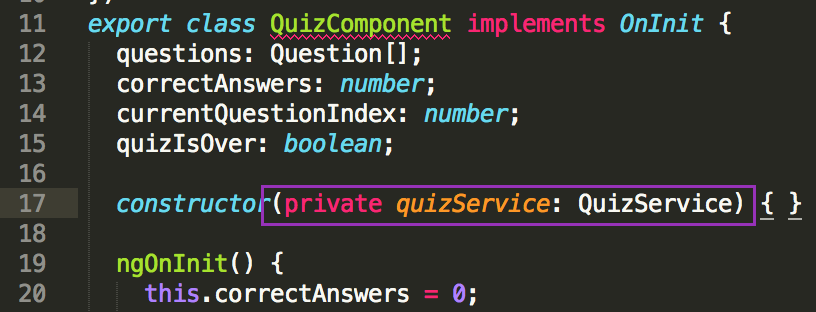

### Creating a Service and Fetching Data

You have your component set-up to display trivia questions and answers, but you only have a couple hardcoded questions and answers. Next you'll create a service to use an API to populate your quiz questions and possible answers.


A service is just one piece of your larger application. Services are used to:
* share data or logic across multiple components of an application to avoid code duplication
* contain an interaction with some other piece of software that you may not have written yourself (like with our API).


1. First, use **Angular CLI** to generate a service named **quiz** within the "quiz" directory. In Cmder or iTerm2, type: 
   iTerm2/Cmder 
   ```bash
   ng g service quiz/quiz
   ```

  
This creates two files in your "src/app/quiz" directory:
  * _quiz.service.ts_ and
  * _quiz.service.spec.ts_

You won't be adding any tests tonight, so you can ignore the _quiz.service.spec.ts_ file.
  

2. You'll use the **HTTPClient Module** that Angular provides, but you need to tell Angular that you want to use it. In Atom, open the _app.module.ts_ file.

  1. Add a new blank line below the `import {NgModule} from '@angular/core';` line and type:
  src/app/app.module.ts
  ```ts
  import { HttpClientModule } from '@angular/common/http';
  ```

  2. In the same file, look for `imports` section within the parameters passed to `@NgModule`. Add a comma after `AppRoutingModule` and add a new line. On this new line, type: `HttpClientModule`.

2.  In Atom, open the _src/app/quiz/quiz.service.ts_ file.

    You'll need to import a method from the **HttpClientModule**, **Observable** from the RxJS library, and your **Question** model. RxJS is a JavaScript implementation for **R**eactive E**x**tensions. It helps make managing asynchronous code easier.

    1. Place your cursor at the end of the first line of the file that reads `import { Injectable } from '@angular/core';` and press `Enter`.

    2. Type: 
       src/app/quiz/quiz.service.ts
       ```ts
    import { HttpClient } from '@angular/common/http';
       ```
    
    3. Add another line and type:
       src/app/quiz/quiz.service.ts
      ```ts
      import { Observable } from 'rxjs';
      ```
    
    4. Press `Enter` twice to move to a new line with a blank line in between and then type: 
       src/app/quiz/quiz.service.ts
       ```ts
       import { Question } from './quiz.model';
       ``` 
       The blank line separates imports from Angular libraries from code that you have written (the Question model).

    5. In between the parenthesis of the `constructor()` code, type: 
       src/app/quiz/quiz.service.ts
       ```ts 
       private http: HttpClient
       ```
    
      

      
This creates an instance of the `HttpClient` service that you imported and assigns it to `http`. It’s private because you don’t want to access it from outside the `QuizService` class.
      

    6. Now, you’re going to add your API request to the **https://cocktail-trivia-api.herokuapp.com/api/sample** URL. Copy the code below:
       src/app/quiz/quiz.service.ts
      ```ts
      getQuestions(): Observable<Question[]> { 
        return this.http.get<Question[]>('https://cocktail-trivia-api.herokuapp.com/api/sample'); 
      }
      ```
      
      
If you built your own API during the Node.js session last month, you can replace the `https://cocktail-trivia-api.herokuapp.com/api/sample` URL with the URL to your own API.  For example if your heroku app was named **my-awesome-api** and you wanted the quiz to be about animals with an easy difficulty you would use the URL `https://my-awesome-api.herokuapp.com/api/category/animals/difficulty/easy`.  Remember you can generate the portion of your URL that should come after the`/api/` portion here: [https://cocktail-trivia-api.herokuapp.com](https://cocktail-trivia-api.herokuapp.com/)
      

    7. Paste the code in the _src/app/quiz/quiz.service.ts_ file just below the `constructor(private http: Http) { }` line

       
#### What does this code do?
It creates a method named `getQuestions`, that makes the `http` request to the URL that accesses the API and returns the JSON (**J**ava**S**cript **O**bject **N**otation) formatted data from the response. 
       

9.  In Atom, open the _src/app/quiz/quiz.component.ts_ file. NO LONGER NEEDED

  1. You need to import the `QuizService`, so that you can use it. Add the following to the list of your other imports: 
     src/app/quiz/quiz.component.ts
     ```ts 
     import { QuizService } from './quiz.service';
     ```

  2. In the parenthesis for `constructor() { }` add:
     src/app/quiz/quiz.component.ts
     ```ts 
     private quizService: QuizService
     ```

      

  Now, you can access the `QuizService methods` via `this.quizService`.

3.  Replace the `this.questions = [...];` array with the following code:
    src/app/quiz/quiz.service.ts
    ```ts
    this.quizService.getQuestions()
      .subscribe(questions => this.questions = questions);
    ```

    

    
#### What does this code do?
This subscribes to the `getQuestions` method that you defined in the `QuizService` since HTTP requests can take a little or a long time to return a response.  When the HTTP request comes back, the `getQuestions` method returns the data to the subscriber and then set that data to the component's `this.questions` so it is available for use in the component's template for display.
    

5. Make sure all of your files are saved.
   
You can tell if a file is unsaved because it will have a small blue circle on the right side of the file tab.
   
  
6. In Google Chrome, checkout your application using a new data source!

     

<!-- Trick markdown to give a little extra space -->    
## 
##### You did it! Great job! Nothing can stop you!

