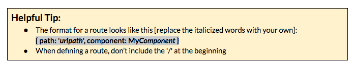

### Part 2: Add a router {#part-2-add-a-router}

It is recommended to watch this video [[http://bit.ly/router-video](https://www.google.com/url?q=http://bit.ly/router-video&sa=D&ust=1479686156301000&usg=AFQjCNFD5AQc0ycAzgtg0dq3pj6SfkbCiw)] (sign-up for free account to view) or read this article [[http://bit.ly/angular2-routing](https://www.google.com/url?q=http://bit.ly/angular2-routing&sa=D&ust=1479686156302000&usg=AFQjCNFl00rr7xlaObQwx_CAzr1oN3YYig)] to see how routers work in Angular 2 &amp; how to configure them.

1.  Create a new component named **about**.
2.  Create a new file in *src/app* and name it** app.routes.ts**
3.  In this new file, we need to import a couple things from the Router module. Add: import { Routes, RouterModule } from &#039;@angular/router&#039;;
4.  Now we need to set our variable that will hold our routes. Add: const routes: Routes = []; This sets a *constant* variable named routes [of imported type Routes] to an empty array. We’ll add our routes to this array.
5.  In your array, add 2 routes:

  1.  &#039;&#039; that loads our QuizComponent [this is the root or homepage path &#039;/&#039;]
  2.  &#039;about&#039; that loads our new AboutComponent [this will load for the path &#039;/about&#039;]

  

1.  We need to import our 2 components, so add those 2 import statements to the top of the file.
2.  Now we need to export our routes, so at the bottom of *app.routes.ts*, add this:  export const QuizAppRoutes = RouterModule.forRoot(routes);
3.  Open the *src/app/app.module.ts* file &amp; add an import. Import QuizAppRoutes from *app.routes.ts* [hint: that needs minor modifications to make that the actual import statement.]
4.  We also need to add QuizAppRoutes in this file’s @NgModule imports.
5.  Last, but not least, we need to define where our router will display the relevant component. In *src/app/app.component.html*, replace &lt;app-quiz&gt;&lt;/app-quiz&gt; with &lt;router-outlet&gt;&lt;/router-outlet&gt;
6.  Visit your app in Chrome to checkout your routes! [http://localhost:4200/](http://localhost:4200/) &amp; [http://localhost:4200/about](http://localhost:4200/about)

