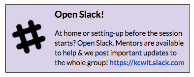
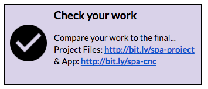

# Project {#project}

Single page applications provide a more native app-like experience to users. They can also be a lot of fun to develop. There are a lot of frameworks available to make this process easier, but choosing one and learning how to use it can be overwhelming. Angular 2 is very opinionated, which means you have less architecture decisions to make than some of the other frameworks. This also means there will be more consistency among Angular 2 projects, so if you’ve worked on one, you can easily jump into a different team’s project.

In this session, we will become familiar with how to use Angular 2 to create a single page trivia app. 

 