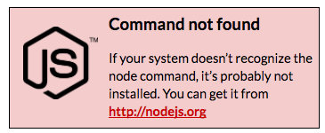
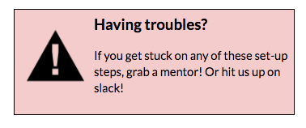

# TODO: Delete this page

### Part 0A: Set-up | Verify NodeJS &amp; npm is installed &amp; Install Angular CLI {#part-0a-set-up-verify-nodejs-npm-is-installed-install-angular-cli}

In order to use Angular CLI later in this lesson, you have to install it via npm, which requires NodeJS. (We won’t be writing a NodeJS application, but the two are essentially installed together.)

1.  Open your terminal / command line

 
  Some of these commands will run slower on Windows computers. To make these processes run faster, it is recommended to run Git Bash as an Administrator. See [here](http://bit.ly/angular-cli-windows) for tips on how to do that.

1.  In Git Bash (windows) or iTerm2 (macs), type: node --version && npm --version
2.  If you get version numbers, then NodeJS and NPM are already installed. Proceed to Step 4.

1.  In Git Bash (windows) or iTerm2 (macs), type: npm install -g angular-cli *This may take a minute or two to complete. Perfect excuse to grab yourself a snack!*
2.  To confirm Angular CLI was installed, while still in your Command Line tool, type: ng version. If you get version numbers, you can move on to the next setup step!

*You may also see a warning saying “Could not start watchman; ...”  This is ok and can be ignored but the version numbers for angular-cli and node should be displayed below that.*

