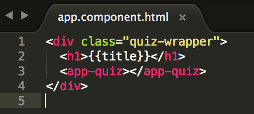

### Part 2: Creating a component

Our app works, but it’s not very exciting. Let’s add some components!

1.  In Git Bash or iTerm2, generate a component named quiz with Angular CLI. Type: `ng g component quiz`

  
This creates a _src/app/quiz_ directory with 4 files in it: _html, css, typescript & spec_.  _spec_ files are to write tests (to make sure your code works). We won't be using these tonight so you can ignore this file.
  

2.  Next, add some styles to your app, so it won’t look bland as you develop it.

  
 
Windows users you’ll need to click the “raw” button to copy code from github to avoid copying the line numbers with the code
    
  

  1.  Copy the CSS styles from this link: [[http://bit.ly/spa-css-a](http://bit.ly/spa-css-a)] & paste into your _src/styles.css_ file. These are global styles that apply to the whole app.
  
  2.  Copy the CSS styles here [[http://bit.ly/spa-css-b](http://bit.ly/spa-css-b)] & paste into your *src/app/app.component.css* file. These styles apply only to the markup in _app.component.html_.
  
  3.  Copy the CSS styles here [[http://bit.ly/spa-css-c](http://bit.ly/spa-css-c)] & paste into *src/app/quiz/quiz.component.css*. These styles apply only to the markup in _quiz.component.html_.
  
      
#### What is this HTML & CSS stuff?!
In an effort to keep the project focused on Single Page Applications, we're providing the HTML & CSS code for you to copy/paste.
 
##### New to HTML/CSS? 
Take a minute to read what you pasted.  Try to predict what you might see in the finished product. If you have questions about any of it, or HTML/CSS in general, grab a mentor! 

##### Know HTML/CSS?
Have at it! Customize the HTML/CSS to your liking!
  

3.  Now that we have styles, let’s add the HTML markup for our templates.

  1.  Copy the HTML code from this link [http://bit.ly/spa-fonts](http://bit.ly/spa-fonts) & paste it into your *src/index.html* file, above the closing &lt;/head&gt; tag. This adds some Google Web Fonts, so we have some pretty fonts in our app.
  
      
  
  2.  Add the **quiz** component html to the **app** component. Copy the HTML code from this link: [http://bit.ly/spa-html-a](http://bit.ly/spa-html-a) & paste it into the *src/app/app.component.html* file.
  
      

   3.  Copy the HTML code from this link: [http://bit.ly/spa-html3c](http://bit.ly/spa-html3c) & paste it into the *src/app/quiz/quiz.component.html* file.

4.  Head on over to Chrome to check out how your app looks.

  
#### App doesn't look like this?
Look back through the steps or grab a mentor!
  
