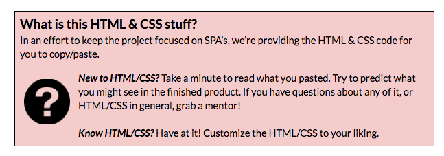
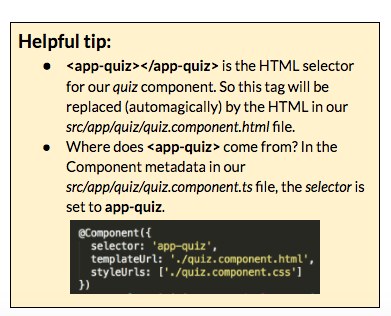
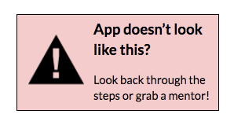

### Part 2: Creating a component

Our app works, but it’s not very exciting. Let’s add some components!

1.  In Git Bash or iTerm2, generate a component named quiz with Angular CLI. Type: `ng g component quiz`

  
This creates a _src/app/quiz_ director with 4 files in it: _html, css, typescript & spec_.  _spec_ files are to write tests (to make sure your code works). We won't be using these tonight so you can ignore this file.
  

2.  Next, add some styles to your app, so it won’t look bland as you develop it.

 Windows users you’ll need to click the “raw” button to copy code from github to avoid copying the line numbers with the code
    

  1.  Copy the CSS styles here [[http://bit.ly/spa-css-a](https://www.google.com/url?q=http://bit.ly/spa-css-a&sa=D&ust=1479686156141000&usg=AFQjCNHxMUSfQXmiQ5XR2tlKbQtZWKetJQ)] &amp; paste into your *src/styles.css* file.These are global styles that apply to the whole app.
  2.  Copy the CSS styles here [[http://bit.ly/spa-css-b](https://www.google.com/url?q=http://bit.ly/spa-css-b&sa=D&ust=1479686156142000&usg=AFQjCNFfXzzZCfus01BRb7a_mtRmYaxCRw)] &amp; paste into your *src/app/app.component.css* file.These styles apply only to the markup in app.component.html.
  3.  Copy the CSS styles here [[http://bit.ly/spa-css-c](https://www.google.com/url?q=http://bit.ly/spa-css-c&sa=D&ust=1479686156143000&usg=AFQjCNH5DXHFCu1alvaRWlZ653U8Vsvs-g)] &amp; paste into *src/app/quiz/quiz.component.css*.These styles apply only to the markup in quiz.component.html.

    

1.  Now that we have styles, let’s add the HTML markup for our templates.

  1.  Copy the HTML here [[http://bit.ly/spa-fonts](https://www.google.com/url?q=http://bit.ly/spa-fonts&sa=D&ust=1479686156149000&usg=AFQjCNH8YCrBjvdwcD7BMrDBn9fzQwlVGg)] &amp; paste into your *src/index.html* file, above the closing &lt;/head&gt; tag.This adds some Google Web Fonts, so we have some pretty fonts in our app.
  2.  Let’s add our *quiz* component html to our *app* component.Copy the HTML here [[http://bit.ly/spa-html-a](http://bit.ly/spa-html-a)] &amp; paste into *src/app/app.component.html*.

      

 1.  Copy the HTML here [[http://bit.ly/spa-html3c](http://bit.ly/spa-html3c)] &amp; paste into *src/app/quiz/quiz.component.html*.
  2.  Head on over to Chrome to check out how your app looks. 

