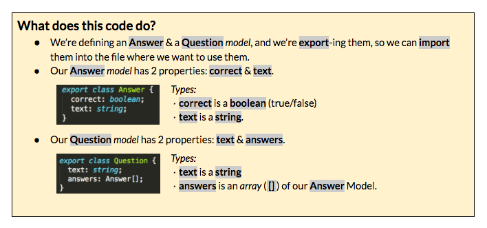

### Part 3A: Adding Data to Our Template {#part-3a-adding-data-to-our-template}

Our template is working and looks pretty, but it’s hardcoded, or, in other words, the data is fixed and can only be edited manually. Let’s add a couple questions and answers to our component, and make the template render our quiz questions dynamically. In Part A, we’ll do some set-up work for data to use in our template. Part B will be to integrate the data with our component’s template (HTML).

Later, we’ll be using an [API](https://www.google.com/url?q=http://bit.ly/CnCgloss&sa=D&ust=1479686156166000&usg=AFQjCNGJrppcfsV8r9eNOVF4hKEJwl_RIA) [Application Programming Interface], to allow us to interface with a set of  questions and answers for our quiz. In order to make that transition go smoothly, we’re going to set-up our data in the same format that will come from our API.

1.  Open your *src/app/quiz/quiz.component.ts* file. In the ngOnInit() [method](https://www.google.com/url?q=http://bit.ly/CnCgloss&sa=D&ust=1479686156169000&usg=AFQjCNEEl_qdefuKpEwpc-LvjU-N2qu7RQ), between the {}, paste the code from here [[http://bit.ly/spa-qa](http://bit.ly/spa-qa].  Your file should look like the one here [[http://bit.ly/spa-3_1](http://bit.ly/spa-3_1)].
2.  Since we’re using TypeScript, we need to set types for the data that we just copied and pasted. This is one file *Angular CLI* won’t generate for us.   Create a new file in *src/app/quiz* &amp; name it **quiz.model.ts**.
3.  In *quiz.model.ts*, add the code found here [[http://bit.ly/spa-model](http://bit.ly/spa-model)]. Feel free to manually type or copy/paste.

  

1.  Now we’re going to import these into *quiz.component.ts*.

  1.  Open *src/app/quiz/quiz.component.ts* &amp; below the import at the top, add: import {} from &#039;./quiz.model&#039;;
  2.  Place your cursor in the middle of {}. And type  A. Sublime should give you an autocomplete suggestion of Answer. [Hit tab or enter/return key for it to autocomplete Answer for you.]
  3.  Add a comma after Answer &amp; repeat process by typing Q [for Question].Printed worksheets see: [http://bit.ly/spa-ts](https://www.google.com/url?q=http://bit.ly/spa-ts&sa=D&ust=1479686156193000&usg=AFQjCNGdM4oSD7-pRBiV9_0928ngBX5DLg)

1.  In the quiz.component.ts file, within the OnInit method, add: questions: Question[]; This uses the imported Question Model to set the type for questions, (the data we set earlier in ngOnInit).