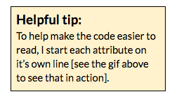
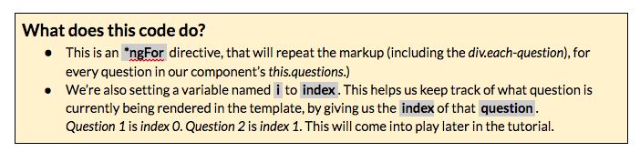
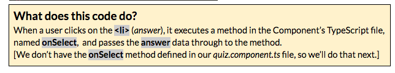
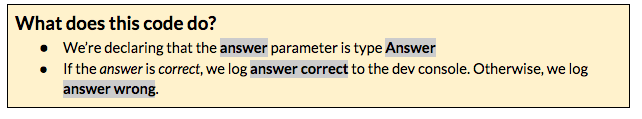

### Part 3B: Adding Data to Our Template {#part-3b-adding-data-to-our-template}

Now that we have our data ready, let’s wire it up to our component’s template. Open src/app/quiz/quiz.component.html &amp; let’s get to it.

1.  In &lt;div class=&quot;quiz-wrapper&quot;&gt;, at the top of the file, add an *ngIf attribute: *ngIf=&quot;questions&quot; Printed worksheets see: [http://bit.ly/spa-if1](http://bit.ly/spa-if1)*ngIf is an Angular attribute directive that will only render our template IF this.questions is defined in our component.
2.  In the markup for &lt;div class=&quot;each-question&quot;&gt;, add the following as an attribute: *ngFor=&quot;let question of questions; let i = index;&quot;

  Printed worksheets see: [http://bit.ly/spa-for1](http://bit.ly/spa-for1) 
  
  
1.  Replace  question here  with {{question.text}}This will use the *question’s text* from our data to populate our template.
2.  Let’s loop through our answers. In the &lt;li&gt; tag, add the following *ngFor attribute: *ngFor=&quot;let answer of question.answers&quot; Printed worksheets see: [http://bit.ly/spa-for2](http://bit.ly/spa-for2)
3.  Replace answer here with {{answer.text}}
4.  We now have our template rendering questions and answers, but nothing happens when a user selects an answer. Let’s add a *click* event so we can start tracking this.

  1.  In that same &lt;li&gt; tag, add a (click) attribute:(click)=&quot;onSelect(answer)&quot;  
      

      

   1.  Open *src/app/quiz/quiz.component.ts*.  Copy the code here [[http://bit.ly/spa-select](http://bit.ly/spa-select] &amp; paste after the ngOnInit() {} method.

    

Your src/app/quiz/quiz.component.ts file should look like the one here [[http://bit.ly/spa-6_b](http://bit.ly/spa-6_b)].