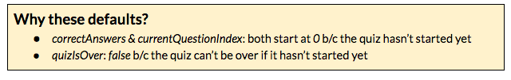

### Part 4: Tally Correct Answers &amp; Show Results {#part-4-tally-correct-answers-show-results}

We now have questions and answers to create a quiz, but at the end of the quiz, the user won’t know how many they answered correctly. Let’s add a counter that keeps track of the correct answers throughout a quiz and displays the results at the end!

1.  Copy the code here [[http://bit.ly/spa-4_1](http://bit.ly/spa-4_1)] &amp; paste into your *src/app/quiz/quiz.component.html* before the final &lt;/div&gt; tag.

  

1.  Open *src/app/quiz/quiz.component.ts*.

  1.  Below questions: Question[]; let’s add 3 new variables and their types:  correctAnswers: number;currentQuestion Index: number; quizIsOver: boolean;
  2.  Then in ngOnInit, before this.questions, let’s set default values for these 3 variables: this.correctAnswers = 0; this.currentQuestionIndex = 0; this.quizIsOver = false;

    1. We  need to increment our correctAnswers variable, every time an answer is correct.  In the onSelect method, within the if (answer.correct) {...} add: this.correctAnswers++; This will update the value of *correctAnswers* + 1, when the *answer* is *correct*.
  2.  We need to increment currentQuestionIndex, every time an answer is selected (correct or not).Below onSelect’s else {...} add: this.currentQuestionIndex++;
  3.  Below this.currentQuestionIndex++; add: if (this.currentQuestionIndex === this.questions.length) {  this.quizIsOver = true;} When the currentQuestionIndex value is the same as the questions.length value, quizIsOver is set to true.

1.  Right now, you see all the quiz questions at once. And even when the results display, the questions/answers are still visible. Let’s add an *ngIf, so we only see 1 question at a time.

1.  Open src/app/quiz/quiz.component.html. In &lt;div class=&quot;q-and-a&quot;&gt;, add attribute: *ngIf=&quot;currentQuestionIndex === i&quot;  Printed worksheets see: [http://bit.ly/spa-if2](https://www.google.com/url?q=http://bit.ly/spa-if2&sa=D&ust=1479686156253000&usg=AFQjCNGB8a6X4JI9NMTbOP5237p1G--0VA) 

1.  **BONUS**: Add a tracker to the top of the quiz that tells the user which question they’re viewing.

  1.  In *src/app/quiz/quiz.component.html*, before *div.quiz* but after opening* div.quiz-wrapper* tag, paste the code from here [[http://bit.ly/spa-track](http://bit.ly/spa-track)]. **Challenge**: Can you explain to your neighbor what this is doing?

