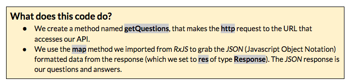
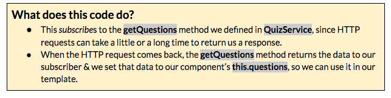

### Part 5: Creating a Service &amp; Fetching Data {#part-5-creating-a-service-fetching-data}

We have our component set-up to display trivia questions and answers, but we only have a couple hardcoded questions &amp; answers. Let’s use an API to populate our quiz questions and possible answers.

A service is just one piece of our larger application. Services are used to:

*   share data or logic across multiple components of an application to avoid code duplication or
*   to encapsulate external interactions (like with our API).

1.  First, use *Angular CLI* to generate a service named *quiz* within the *quiz* directory. Open your CLI tool.Type:  ng g service quiz/quiz

       

1.  Open *src/app/quiz/quiz.service.ts*. We need to import some methods from the *HTTP Module &amp; RxJS* [*Angular CLI* installed both of these for us so we can simply import to use them]. Add these imports below the *@angular/core import*: import { Http, Response } from &#039;@angular/http&#039;; import &#039;rxjs/add/operator/map&#039;; 
2.  In the parenthesis for constructor(), add: private http: Http This creates an instance of the Http service that we imported and assigns it to http. It’s private because we don’t want to access it from outside the QuizService class.
3.  Now, we’re going to add our API request to **//cocktail-trivia-api.herokuapp.com/api/sample**. Copy the code from here [[http://bit.ly/spa-http](https://www.google.com/url?q=http://bit.ly/spa-http&sa=D&ust=1479686156271000&usg=AFQjCNFQxlhCBv8eVfsRAPVhgJ-Lu0ESzg)] &amp; paste below constructor(private http: Http) { }

1.  Open *src/app/quiz/quiz.component.ts*.

  1.  We need to import the QuizService, so that we can use it. Add the following to the list of your other imports: import { QuizService } from &#039;./quiz.service&#039;;
  2.  In our Component metadata, we need to add QuizService as a provider. Add a comma &amp; a new line after styleUrls: [&#039;./quiz.component.css&#039;] and add: providers: [QuizService]
3.  In the parenthesis for constructor() { } add: private quizService: QuizServiceNow, we can access the QuizService methods via this.quizService.
4.  Replace this.questions = [...]; with: this.quizService.getQuestions()  .subscribe(questions =&gt; this.questions = questions);
